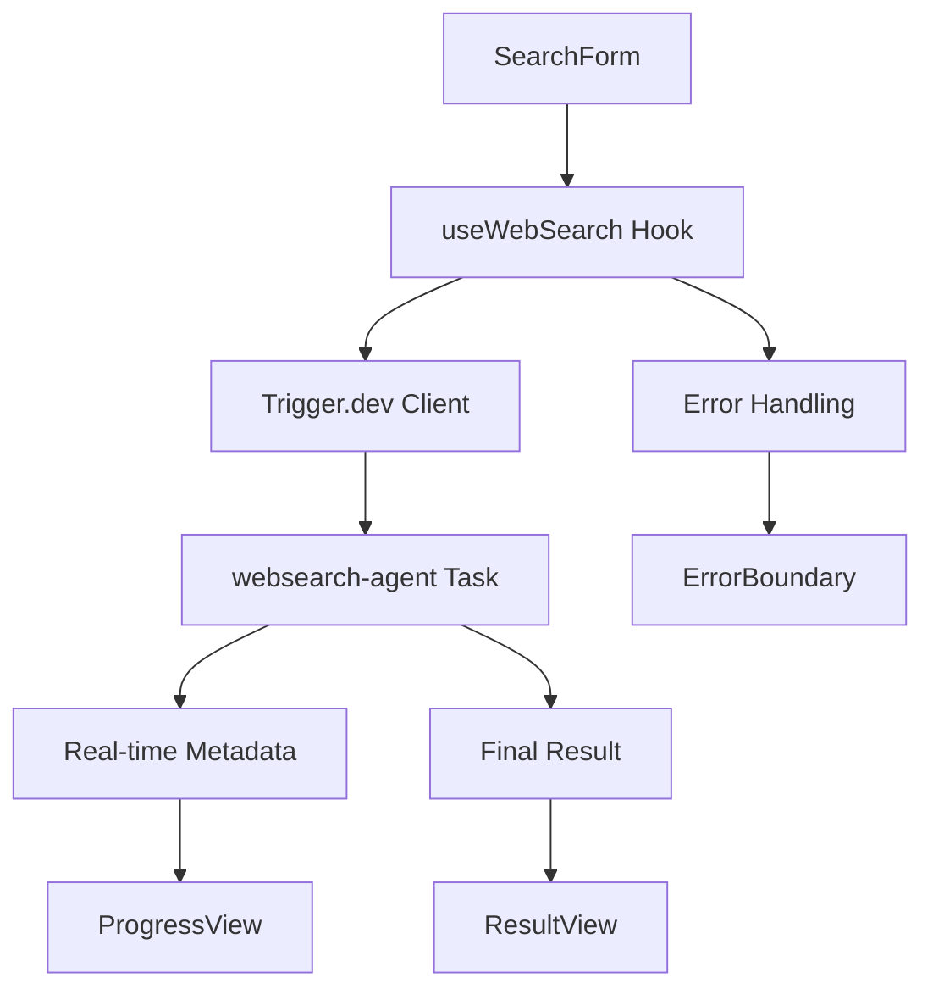
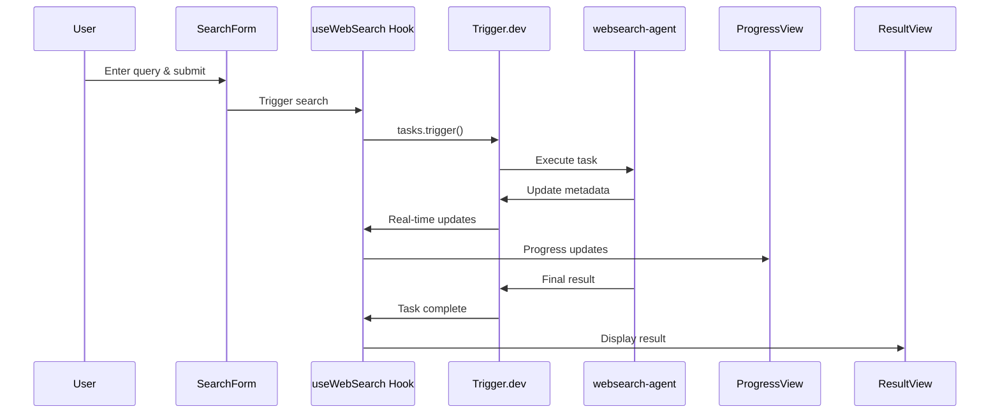

# WebSearch Agent Frontend - Implementation Planning

## Project Overview
Create a minimal Next.js frontend to trigger the `websearch-agent` Trigger.dev task, monitor real-time progress, and display results. The frontend will be as simple as possible while providing essential functionality.

## Implementation Strategy

### Phase 1: Project Setup & Dependencies
- Install required dependencies for Trigger.dev integration
- Configure environment variables for Trigger.dev connection
- Set up basic Next.js structure with TypeScript

### Phase 2: Core Infrastructure
- Create type definitions for websearch-agent integration
- Set up Trigger.dev client configuration
- Implement authentication token management

### Phase 3: UI Components
- Build search form component
- Create progress monitoring component with real-time updates
- Implement result display component
- Add error handling and loading states

### Phase 4: Integration & Testing
- Connect components with Trigger.dev real-time subscriptions
- Test end-to-end workflow
- Handle edge cases and error scenarios

## Data Structure Changes

### New Type Definitions (`src/types/websearch.ts`)
```typescript
// Application state management
interface AppState {
  stage: 'idle' | 'processing' | 'complete' | 'error';
  query: string;
  runId?: string;
  publicAccessToken?: string;
  progress: WebSearchMetadata;
  result?: WebSearchOutput;
  error?: string;
}

// Input for websearch-agent task
interface WebSearchInput {
  query: string;
  searchParams?: {
    searchDepth?: "basic" | "advanced";
    topic?: "general" | "news";
    maxResults?: number;
  };
  model?: string;
  maxIterations?: number;
}

// Metadata from websearch-agent task
interface WebSearchMetadata {
  progress: number;
  actionHistory: string[];
  currentAction?: string;
  totalIterations: number;
  currentIteration: number;
  lastUpdated: string;
}

// Output from websearch-agent task
interface WebSearchOutput {
  answer: string | null;
  conversation: Array<{
    role: string;
    content: string | null;
    tool_calls?: any[];
    tool_call_id?: string;
  }>;
}
```

## File Structure Changes

### New Files to Create
```
trigger-dev-frontend/
├── src/
│   ├── types/
│   │   └── websearch.ts              # Type definitions
│   ├── lib/
│   │   ├── trigger.ts                # Trigger.dev client setup
│   │   └── utils.ts                  # Utility functions
│   ├── hooks/
│   │   └── useWebSearch.ts           # Custom hook for search logic
│   ├── components/
│   │   ├── SearchForm.tsx            # Query input form
│   │   ├── ProgressView.tsx          # Real-time progress display
│   │   ├── ResultView.tsx            # Final result display
│   │   └── ErrorBoundary.tsx         # Error handling wrapper
│   └── app/
│       ├── page.tsx                  # Main search page (modify existing)
│       ├── layout.tsx                # Root layout (modify existing)
│       └── globals.css               # Global styles (modify existing)
├── .env.local                        # Environment variables
└── package.json                      # Dependencies (modify existing)
```

### Files to Modify
- `package.json` - Add Trigger.dev dependencies
- `src/app/page.tsx` - Replace with search interface
- `src/app/layout.tsx` - Add TriggerAuthContext provider
- `src/app/globals.css` - Add custom styles for progress and results

## Environment Configuration

### Required Environment Variables (`.env.local`)
```bash
# Trigger.dev Configuration
TRIGGER_SECRET_KEY=your_trigger_secret_key
NEXT_PUBLIC_TRIGGER_API_URL=https://api.trigger.dev
# Note: No public key needed - publicAccessToken is generated at runtime per task
```

## Component Architecture

### State Management Flow


### Real-time Data Flow


## Implementation Approach

### Minimal Feature Set
1. **Single Page Interface**: One page handling all states
2. **Essential Components**: Only SearchForm, ProgressView, ResultView
3. **Basic Styling**: Clean, functional design with Tailwind CSS
4. **Core Functionality**: Trigger task, show progress, display result

### Progressive Enhancement
- Start with basic form submission
- Add real-time progress monitoring
- Implement result display
- Add error handling and edge cases

### Technical Decisions
- **Client-side State**: Use React useState for simplicity
- **Real-time Updates**: Trigger.dev Realtime hooks
- **Authentication**: Public access tokens per session
- **Styling**: Tailwind CSS for rapid development
- **Error Handling**: React Error Boundaries

## Risk Mitigation

### Potential Issues & Solutions
1. **WebSocket Connection Issues**
   - Implement connection retry logic
   - Fallback to polling if real-time fails

2. **Token Management**
   - Generate tokens server-side
   - Handle token expiration gracefully

3. **Long-running Tasks**
   - Show detailed progress information
   - Allow task cancellation if needed

4. **Mobile Responsiveness**
   - Test on mobile devices
   - Ensure touch-friendly interface

## Success Criteria
- [ ] User can input search query and trigger task
- [ ] Real-time progress updates display correctly
- [ ] Final results show properly formatted answer
- [ ] Error states are handled gracefully
- [ ] Interface is responsive and accessible
- [ ] End-to-end workflow completes successfully

