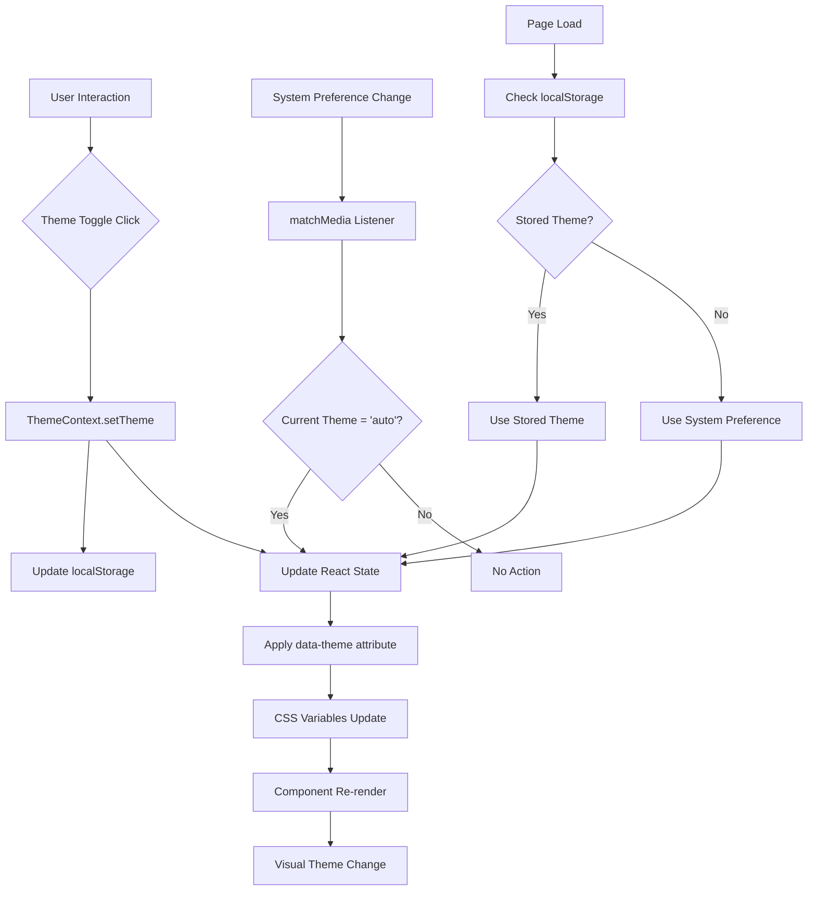

# Dark Mode and Light Mode Implementation Task List

Implementation of comprehensive theme switching functionality for the WebSearch Agent Frontend.

## Phase 1: Foundation Setup

### Theme Context & Hook Development
- [x] Create `src/contexts/ThemeContext.tsx`
  - [x] Implement ThemeProvider component with React Context
  - [x] Add theme state management (light/dark/auto)
  - [x] Implement localStorage persistence for theme preference
  - [x] Add system preference detection via `matchMedia`
  - [x] Handle theme initialization and cleanup
  
- [x] Create `src/hooks/useTheme.ts`
  - [x] Export useTheme hook for consuming theme context
  - [x] Provide theme switching functions (setTheme, toggleTheme)
  - [x] Add theme validation and error handling
  - [x] Include TypeScript type definitions

- [x] Create `src/lib/theme-utils.ts`
  - [x] Add utility functions for theme operations
  - [x] Implement theme preference storage helpers
  - [x] Add system theme detection functions
  - [x] Create theme validation utilities

### Type Definitions
- [x] Create `src/types/theme.ts`
  - [x] Define ThemeContextType interface
  - [x] Add Theme type union ('light' | 'dark' | 'auto')
  - [x] Create theme configuration types
  - [x] Export all theme-related type definitions

### CSS Variables Enhancement
- [x] Update `src/app/globals.css`
  - [x] Expand CSS variables for comprehensive color system
  - [x] Define semantic color tokens (primary, secondary, accent, etc.)
  - [x] Add component-specific color variables
  - [x] Implement `[data-theme="dark"]` selector for dark mode
  - [x] Create theme transition animations
  - [x] Maintain backward compatibility with existing variables

## Phase 2: Core Integration

### Layout Integration
- [x] Update `src/app/layout.tsx`
  - [x] Import and integrate ThemeProvider wrapper
  - [x] Add theme data attribute to HTML element
  - [x] Ensure theme context is available to all components
  - [x] Handle SSR compatibility for theme initialization

### Theme Toggle Component
- [x] Create `src/components/ThemeToggle.tsx`
  - [x] Build toggle switch with three states (auto/light/dark)
  - [x] Add smooth transition animations
  - [x] Implement accessible keyboard navigation
  - [x] Include proper ARIA labels and screen reader support
  - [x] Add visual indicators for current theme state
  - [x] Create responsive design for mobile compatibility

### Main Page Updates
- [x] Update `src/app/page.tsx`
  - [x] Replace hardcoded color classes with theme-aware alternatives
  - [x] Update background colors for main layout
  - [x] Modify header styling for theme compatibility
  - [x] Update footer styling with theme support
  - [x] Ensure proper contrast ratios in both themes

## Phase 3: Component Updates

### SearchForm Component
- [x] Update `src/components/SearchForm.tsx`
  - [x] Replace hardcoded input styling with theme variables
  - [x] Update button colors and hover states
  - [x] Modify border colors for theme compatibility
  - [x] Update error state styling for both themes
  - [x] Ensure advanced options panel works in both themes

### ProgressView Component
- [x] Update `src/components/ProgressView.tsx`
  - [x] Update progress bar colors for theme compatibility
  - [x] Modify background colors and borders
  - [x] Update action history timeline styling
  - [x] Ensure loading animations work in both themes
  - [x] Update text colors and contrast ratios

### ResultView Component
- [x] Update `src/components/ResultView.tsx`
  - [x] Update content display background and borders
  - [x] Modify code highlighting for dark theme compatibility
  - [x] Update markdown rendering styles
  - [x] Ensure proper text contrast in both themes
  - [x] Update button styling for theme consistency

### PasswordAuth Component
- [x] Update `src/components/PasswordAuth.tsx`
  - [x] Update form input styling for theme compatibility
  - [x] Modify button colors and hover states
  - [x] Update background and border colors
  - [x] Ensure error message styling works in both themes

### Additional Components
- [ ] Update `src/components/ErrorBoundary.tsx`
  - [ ] Update error display styling for theme compatibility
  - [ ] Modify background and text colors
  - [ ] Ensure error message readability in both themes

- [ ] Update `src/components/MarkdownRenderer.tsx`
  - [ ] Update code block styling for dark theme
  - [ ] Modify syntax highlighting colors
  - [ ] Update blockquote and list styling
  - [ ] Ensure proper contrast for all markdown elements

- [ ] Update `src/components/MarkdownDemo.tsx`
  - [ ] Update demonstration content styling
  - [ ] Ensure all demo elements work in both themes

## Phase 4: Integration & Testing

### Header Integration
- [ ] Integrate ThemeToggle into main page header
  - [ ] Position toggle button appropriately in header
  - [ ] Ensure toggle doesn't interfere with existing layout
  - [ ] Add proper spacing and alignment
  - [ ] Test responsive behavior on mobile devices

### CSS Optimization
- [ ] Optimize CSS variables and theme switching
  - [ ] Minimize redundant CSS variable declarations
  - [ ] Ensure smooth transitions between themes
  - [ ] Optimize for performance (avoid layout shifts)
  - [ ] Add fallback values for older browsers

### Accessibility Enhancements
- [ ] Implement comprehensive accessibility features
  - [ ] Add proper ARIA labels for theme controls
  - [ ] Ensure keyboard navigation works correctly
  - [ ] Test with screen readers
  - [ ] Validate color contrast ratios (WCAG 2.1 AA)
  - [ ] Add focus indicators for theme toggle

## Phase 5: Advanced Features & Polish

### Enhanced Theme Support
- [ ] Add high contrast mode improvements
  - [ ] Enhance existing high contrast media query support
  - [ ] Add specific high contrast theme option
  - [ ] Improve border visibility in high contrast mode

- [ ] Implement theme transition animations
  - [ ] Add smooth color transitions when switching themes
  - [ ] Prevent jarring visual changes
  - [ ] Optimize transition performance

### Testing & Validation
- [ ] Comprehensive testing across all components
  - [ ] Test theme switching functionality
  - [ ] Validate theme persistence across browser sessions
  - [ ] Test system preference detection
  - [ ] Ensure all components render correctly in both themes
  - [ ] Test responsive design in both themes

- [ ] Browser compatibility testing
  - [ ] Test in major browsers (Chrome, Safari, Firefox, Edge)
  - [ ] Validate CSS variable support
  - [ ] Test localStorage functionality
  - [ ] Ensure graceful degradation for unsupported browsers

### Performance Optimization
- [ ] Optimize theme switching performance
  - [ ] Minimize re-renders during theme changes
  - [ ] Optimize CSS variable updates
  - [ ] Ensure smooth user experience
  - [ ] Add loading states if needed

## Implementation Notes

### File Paths Summary
```
NEW FILES:
- src/contexts/ThemeContext.tsx ✅
- src/hooks/useTheme.ts ✅
- src/lib/theme-utils.ts ✅
- src/types/theme.ts ✅
- src/components/ThemeToggle.tsx ✅

UPDATED FILES:
- src/app/globals.css ✅
- src/app/layout.tsx ✅
- src/app/page.tsx ✅
- src/components/SearchForm.tsx ✅
- src/components/ProgressView.tsx ✅
- src/components/ResultView.tsx
- src/components/PasswordAuth.tsx ✅
- src/components/ErrorBoundary.tsx
- src/components/MarkdownRenderer.tsx
- src/components/MarkdownDemo.tsx
```

### Mermaid Diagram: Theme Implementation Flow



### Priority Levels
- **High Priority**: Phase 1 & 2 (Foundation and Core Integration)
- **Medium Priority**: Phase 3 (Component Updates)
- **Low Priority**: Phase 4 & 5 (Advanced Features)

### Estimated Timeline
- Phase 1: 2-3 days ✅ COMPLETED
- Phase 2: 2-3 days ✅ COMPLETED
- Phase 3: 3-4 days (In Progress - 3/6 components completed)
- Phase 4: 1-2 days
- Phase 5: 1-2 days

**Total Estimated Time**: 9-14 days
